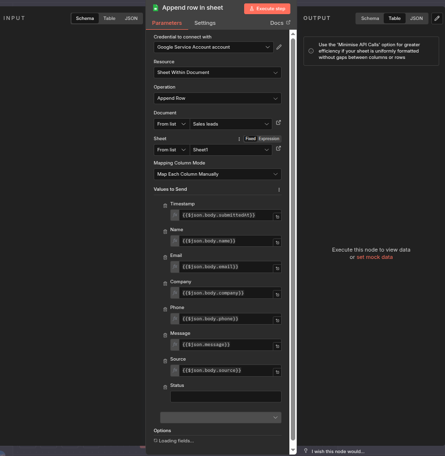
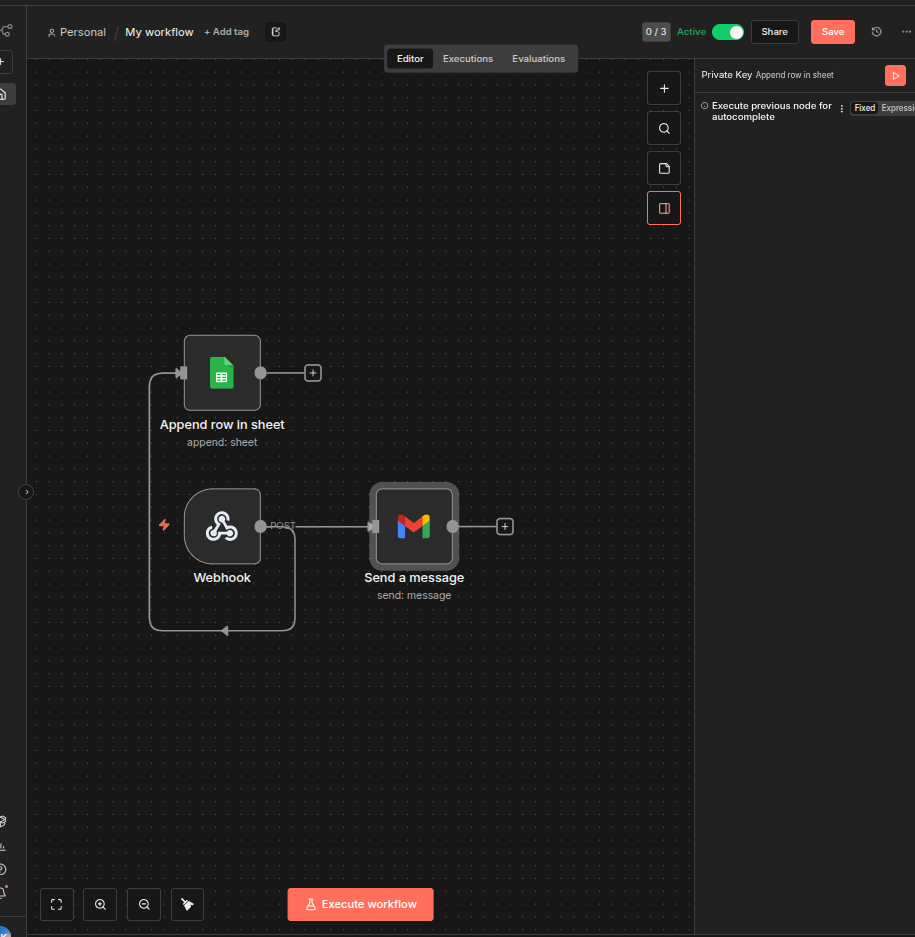

# Lead Capture System with n8n Automation

A Next.js application that captures leads through a contact form and automatically processes them using n8n workflows. Lead data is stored in Google Sheets and notifications are sent via email.

## Table of Contents

- [Overview](#overview)
- [Features](#features)
- [Prerequisites](#prerequisites)
- [Installation](#installation)
- [n8n Setup](#n8n-setup)
- [Google Cloud Console Setup](#google-cloud-console-setup)
- [Environment Variables](#environment-variables)
- [Running the Application](#running-the-application)
- [Workflow Configuration](#workflow-configuration)
- [Troubleshooting](#troubleshooting)

## Overview

This project consists of two main components:

1. **Next.js Frontend**: A modern, responsive contact form built with React, TypeScript, and Tailwind CSS
2. **n8n Automation**: A workflow that processes form submissions, stores data in Google Sheets, and sends notifications

## Features

- Responsive contact form with real-time validation
- Automatic data storage in Google Sheets
- Email notifications for new leads
- Type-safe API with Zod validation
- Modern UI with Tailwind CSS
- Toast notifications for user feedback

## Prerequisites

Before you begin, ensure you have the following installed:

- **Node.js** (v18 or higher) - [Download here](https://nodejs.org/)
- **npm** or **yarn** package manager
- **Git** - [Download here](https://git-scm.com/)
- **Google Cloud Console Account** - [Sign up here](https://console.cloud.google.com/)
- **Docker** (optional, for running n8n via Docker) - [Download here](https://www.docker.com/)

## Installation

### 1. Clone the Repository

```bash
git clone <your-repository-url>
cd leadsys
```

### 2. Install Dependencies

```bash
npm install
```

### 3. Set Up Environment Variables

Create a `.env.local` file in the root directory:

```bash
cp .env.example .env.local
```

Edit `.env.local` and add your n8n webhook URL (you'll get this after setting up n8n):

```env
N8N_WEBHOOK_URL=your_n8n_webhook_url_here
```

## n8n Setup

n8n is an automation tool that processes your form submissions. You can run it locally via npm or Docker.

### Option 1: Install n8n via npm (Recommended for Development)

```bash
npm install n8n -g
```

**Start n8n:**

```bash
n8n start
```

n8n will be available at `http://localhost:5678`

**Documentation:**
- [n8n Installation Guide](https://docs.n8n.io/hosting/installation/npm/)
- [n8n Quickstart](https://docs.n8n.io/try-it-out/)

### Option 2: Install n8n via Docker

**Pull the Docker image:**

```bash
docker pull n8nio/n8n
```

**Run n8n container:**

```bash
docker run -it --rm \
  --name n8n \
  -p 5678:5678 \
  -v ~/.n8n:/home/node/.n8n \
  n8nio/n8n
```

**For production with persistence:**

```bash
docker run -d \
  --name n8n \
  -p 5678:5678 \
  -v ~/.n8n:/home/node/.n8n \
  --restart unless-stopped \
  n8nio/n8n
```

n8n will be available at `http://localhost:5678`

**Documentation:**
- [n8n Docker Installation](https://docs.n8n.io/hosting/installation/docker/)
- [n8n Docker Compose](https://docs.n8n.io/hosting/installation/docker-compose/)

## Google Cloud Console Setup

You need to create a Google Service Account to allow n8n to write to Google Sheets.

### Step 1: Create a New Project

1. Go to [Google Cloud Console](https://console.cloud.google.com/)
2. Click on the project dropdown at the top
3. Click **"NEW PROJECT"**
4. Enter a project name (e.g., "Lead Capture System")
5. Click **"CREATE"**

### Step 2: Enable Google Sheets API

1. In the Google Cloud Console, go to **"APIs & Services"** > **"Library"**
2. Search for **"Google Sheets API"**
3. Click on it and click **"ENABLE"**

Direct link: [Enable Google Sheets API](https://console.cloud.google.com/apis/library/sheets.googleapis.com)

### Step 3: Create a Service Account

1. Go to **"APIs & Services"** > **"Credentials"**
   - Direct link: [Credentials Page](https://console.cloud.google.com/apis/credentials)
2. Click **"CREATE CREDENTIALS"** > **"Service Account"**
3. Enter a service account name (e.g., "n8n-sheets-access")
4. Click **"CREATE AND CONTINUE"**
5. For the role, select **"Editor"** or **"Owner"**
6. Click **"CONTINUE"** then **"DONE"**

### Step 4: Create and Download Service Account Key

1. In the **Credentials** page, find your newly created service account
2. Click on the service account email
3. Go to the **"KEYS"** tab
4. Click **"ADD KEY"** > **"Create new key"**
5. Select **JSON** format
6. Click **"CREATE"**
7. The JSON key file will be downloaded automatically
8. **Keep this file secure** - you'll need it for n8n configuration

### Step 5: Share Your Google Sheet

1. Create a new Google Sheet or open an existing one
2. Click the **"Share"** button
3. Add the service account email (found in the JSON key file as `client_email`)
4. Give it **"Editor"** permissions
5. Click **"Send"**

## Environment Variables

Create a `.env.local` file in the project root:

```env
# n8n Webhook URL (get this from n8n after creating the workflow)
N8N_WEBHOOK_URL=http://localhost:5678/webhook/your-webhook-id
```

## Running the Application

### 1. Start n8n (if not already running)

```bash
# If using npm
n8n start

# If using Docker
docker start n8n
```

### 2. Configure n8n Workflow

1. Open n8n at `http://localhost:5678`
2. Create a new workflow
3. Add the following nodes:

   - **Webhook** node (trigger)
   - **Google Sheets** node (append row)
   - **Gmail** node (send message) - optional

#### Webhook Node Configuration:

- Method: POST
- Path: Choose a unique path (e.g., `lead-capture`)
- Copy the webhook URL

#### Google Sheets Node Configuration:



- Credential: Add your Google Service Account credentials (upload the JSON key)
- Resource: Sheet Within Document
- Operation: Append Row
- Document: Select your Google Sheet
- Sheet: Select the sheet name (e.g., "Sheet1")
- Mapping Column Mode: Map Each Column Manually
- Map the following fields:
  - Timestamp: `{{$json.body.submittedAt}}`
  - Name: `{{$json.body.name}}`
  - Email: `{{$json.body.email}}`
  - Company: `{{$json.body.company}}`
  - Phone: `{{$json.body.phone}}`
  - Message: `{{$json.message}}`
  - Source: `{{$json.body.source}}`
  - Status: (leave empty or set a default)

#### Workflow Overview:



4. **Activate** the workflow
5. Copy the webhook URL and add it to your `.env.local` file

### 3. Start the Next.js Development Server

```bash
npm run dev
```

The application will be available at `http://localhost:3000`

## Workflow Configuration

Your n8n workflow should look like this:

```
Webhook → Google Sheets (Append Row) → Send Message (Gmail)
```

Make sure to:
- Set the webhook to accept POST requests
- Configure Google Sheets credentials properly
- Map all form fields correctly
- Test the workflow before going live

## Troubleshooting

### n8n Connection Issues

**Problem**: "N8N_WEBHOOK_URL is not defined"
- **Solution**: Make sure you've created the `.env.local` file and added the webhook URL

**Problem**: n8n webhook returns 404
- **Solution**: Check that the workflow is activated in n8n

### Google Sheets Issues

**Problem**: "Insufficient permissions" error
- **Solution**: Make sure you've shared the Google Sheet with the service account email

**Problem**: Data not appearing in sheets
- **Solution**:
  - Check that the Google Sheets API is enabled
  - Verify the sheet name in the n8n node configuration
  - Check n8n execution logs for errors

### Application Issues

**Problem**: Form submission fails
- **Solution**:
  - Check browser console for errors
  - Verify the API route at `/api/contact` is working
  - Check that n8n is running and accessible

**Problem**: "Invalid form data" error
- **Solution**: Check that all required fields (name, email, message) are filled

### Port Already in Use

**Problem**: Port 3000 or 5678 already in use
- **Solution**:
  ```bash
  # For Next.js (use different port)
  npm run dev -- -p 3001

  # For n8n
  n8n start --port 5679
  ```

## Tech Stack

- **Frontend**: Next.js 16, React 19, TypeScript
- **Styling**: Tailwind CSS 4
- **Validation**: Zod
- **Notifications**: React Hot Toast
- **Automation**: n8n
- **Storage**: Google Sheets
- **Email**: Gmail (via n8n)

## Project Structure

```
leadsys/
├── app/
│   ├── api/
│   │   └── contact/
│   │       └── route.ts          # API endpoint for form submission
│   ├── layout.tsx                # Root layout
│   └── page.tsx                  # Home page with contact form
├── components/
│   └── ContactForm.tsx           # Contact form component
├── lib/
│   └── validations.ts            # Zod schemas
├── types/
│   └── index.ts                  # TypeScript type definitions
├── public/
│   ├── googlesheet.png          # Google Sheets setup screenshot
│   └── setup.png                # n8n workflow screenshot
├── .env.local                    # Environment variables (create this)
└── package.json
```

## Support & Resources

- [n8n Documentation](https://docs.n8n.io/)
- [Next.js Documentation](https://nextjs.org/docs)
- [Google Sheets API](https://developers.google.com/sheets/api)
- [Tailwind CSS](https://tailwindcss.com/docs)

## License

This project is open source and available under the MIT License.
